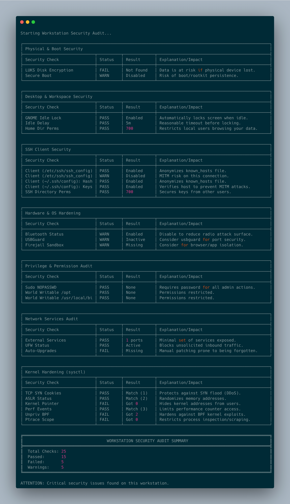

# Security Hardening & Auditing

Psiloc includes a suite of security tools specifically tailored for **Debian-based workstations and laptops**. These tools help you audit your current security posture, apply hardening measures, and revert them if necessary.

## Security Scripts

### 1. Security Audit (`audit.sh`)
The [audit.sh](../scripts/audit.sh) script performs a non-intrusive scan of your system to identify potential security gaps.

- **Physical Security**: Checks for LUKS encryption, Secure Boot status, and Home directory permissions.
- **Kernel & Network**: Checks for ASLR, Ptrace protection, BPF hardening, and sensitive sysctl parameters.
- **Desktop Security**: Verifies GNOME idle lock settings and Bluetooth status.
- **Application Sandboxing**: Checks if `firejail` and `usbguard` are installed and active.
- **SSH Configuration**: Audits both client and server SSH settings for best practices.

### 2. Security Hardening (`harden.sh`)
The [harden.sh](../scripts/harden.sh) script applies defensive measures to reduce the attack surface. It is **fully interactive** and will prompt you to confirm each action.

- **Firewall (UFW)**: Configures a workstation-friendly "deny incoming, allow outgoing" policy.
- **Kernel Hardening**: Sets restrictive `sysctl` parameters to protect against common exploits.
- **SSH Hardening**: Enforces `HashKnownHosts` and `StrictHostKeyChecking` for the client.
- **Security Tools**: Installs and configures `usbguard`, `firejail`, and `unattended-upgrades`.
- **System Defaults**: Sets a restrictive `umask 027` and protects shared memory (`/dev/shm`).

### 3. Hardening Reversal (`unharden.sh`)
The [unharden.sh](../scripts/unharden.sh) script allows you to safely revert the changes made by the hardening script. Like the hardening script, it is **fully interactive**.

- **Firewall Reset**: Disables UFW and resets rules to defaults.
- **Tool Removal**: Uninstalls `usbguard` and `firejail`.
- **Kernel Restore**: Removes custom hardening configurations and restores defaults.
- **SSH Restore**: Resets client and server configurations to standard Debian defaults.
- **System Defaults**: Reverts `umask` to `022` and removes fstab modifications.

## Usage

You can access these tools through the main setup menu:

```bash
cd scripts/
./setup.sh
```

- Option **20**: Run Security Audit
- Option **23**: Revert Security Hardening

Alternatively, run them directly (requires sudo for hardening/unhardening):

```bash
./scripts/audit.sh
sudo ./scripts/harden.sh
sudo ./scripts/unharden.sh
```
## Example Audit Output


## Disclaimer
These scripts are designed for standard Debian-based desktop/laptop environments. Use caution on servers or systems with highly customized kernels/partitioning. Always review the interactive prompts before confirming a change.
